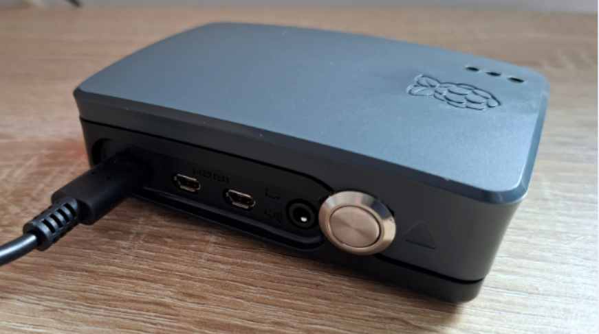
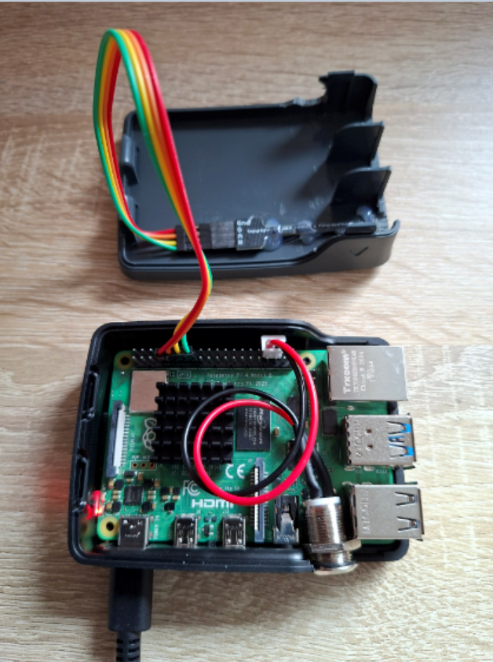
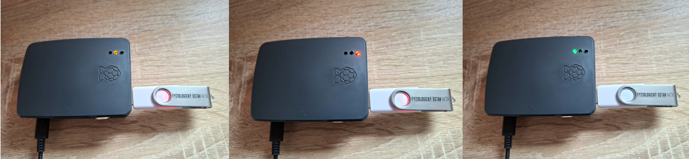
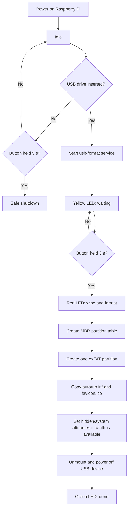

# RPi USB purifier
A Raspberry Pi USB reset box for safely wiping and reformatting presentation flash drives in a semi-isolated workflow before re-use.

The device waits for a USB flash drive, requires a long button press, formats the drive as a standard Windows-compatible exFAT volume, copies `autorun.inf` and `favicon.ico` to the root of the drive, and uses a traffic-light LED module to show state.

> **Important:** this project is a convenience and risk-reduction tool. It does **not** provide 100% protection against malware, firmware-level attacks, malicious USB devices, BadUSB-style HID attacks, etc.

---

## Photos

### Device



### Open enclosure / wiring



### Closed enclosure / traffic light



---

## What it does

```text
No USB drive inserted:
  Hold button for 5 seconds -> safe Raspberry Pi shutdown

USB drive inserted:
  Yellow LED -> USB drive detected, waiting for confirmation
  Hold button for 3 seconds -> wipe and format USB drive
  Red LED -> formatting, do not remove the drive
  Green LED -> done, safe to remove the drive
```

The resulting USB flash drive is created as:

```text
Partition table: MBR / msdos
Filesystem:      exFAT
Volume label:    IPHYS CAS
Root files:      autorun.inf, favicon.ico
```

`autorun.inf` is used only to set the drive label and icon in Windows Explorer. Modern Windows versions do not use USB `autorun.inf` to automatically run arbitrary programs from removable USB drives, which is a security feature.

Example `autorun.inf`:

```ini
[autorun]
icon=favicon.ico
label=IPHYS CAS
```

---

## Credits

This project was inspired by:

- HiroYokoyama, **usb-drive-formatting-system**: <https://github.com/HiroYokoyama/usb-drive-formatting-system>

Main differences in this build:

- formats as **exFAT** instead of FAT32;
- copies `autorun.inf` and `favicon.ico` after formatting;
- uses a Pi-Stop traffic-light module with red/yellow/green states;
- adds a 5-second safe shutdown function when no USB drive is present;
- adds extra safety checks for USB device type and maximum drive size.

---

## Hardware

Parts used in this build were sourced from RPishop.cz. Equivalent parts from other suppliers should work.

| Part | Purpose | Example link |
|---|---|---|
| Raspberry Pi 4B starter kit, 4GB, case, 64GB microSD, power supply | Main computer | <https://rpishop.cz/280602/raspberry-pi-4b-oficialni-star-t-box-4gb/> |
| Pi-Stop SC13675 traffic light for Raspberry Pi | Red/yellow/green status indication | <https://rpishop.cz/led/1395-pi-stop-sc13675.html> |
| Female/Male jumper wires, 20 cm, 10 pcs | Wiring | <https://rpishop.cz/dratove-propojky/5684-dratove-propojky-femalemale-20-cm-10-ks.html> |
| 12 mm metal push button switch | Larger panel-mounted button option | <https://rpishop.cz/557903/kovovy-tlacitkovy-spinac-12-mm/> |
| Low-cost USB flash drives | Presentation media to be reformatted | any standard USB flash drive |

---

## GPIO wiring

Useful pinout references:

- Raspberry Pi GPIO pinout: <https://pinout.xyz/>
- Pi-Stop traffic-light pinout reference: <https://pinout.zerostem.io/pinout/pi_stop>

This build uses **BCM GPIO numbering** in Python.

| Function | BCM GPIO | Physical pin | Notes |
|---|---:|---:|---|
| Pi-Stop green LED | GPIO17 | pin 11 | Done / safe to remove |
| Pi-Stop yellow LED | GPIO27 | pin 13 | Waiting / ready |
| Pi-Stop red LED | GPIO22 | pin 15 | Formatting / error |
| Pi-Stop GND | GND | pin 9 | Common ground |
| Button signal | GPIO16 | pin 36 | Button input |
| Button ground | GND | pin 34 | Button ground |

Button wiring:

```text
button contact 1 -> physical pin 36 / GPIO16
button contact 2 -> physical pin 34 / GND
```

The button is read with the internal pull-up resistor enabled. The GPIO state is therefore:

```text
not pressed -> HIGH
pressed     -> LOW
```
## Operating principle




## Install Raspberry Pi OS and packages

This guide assumes Raspberry Pi OS is already installed on the microSD card. A Lite installation is sufficient, but the Desktop version also works.

Boot the Raspberry Pi and open a terminal.

Update the OS:

```bash
sudo apt update
sudo apt full-upgrade -y
sudo reboot
```

After reboot, install required packages:

```bash
sudo apt update
sudo apt install -y python3-rpi.gpio dosfstools exfatprogs parted util-linux udisks2 nano fatattr
```

`fatattr` is optional but useful. It allows the script to mark `autorun.inf` and `favicon.ico` as hidden/system on FAT/exFAT filesystems. If it is not available on your distribution, the formatter still works; the files may simply remain visible in Windows.

---

## Prepare project files

Create these files on the Raspberry Pi:

```text
/usr/local/bin/format_usb.py
/usr/local/bin/button_shutdown_monitor.py
/etc/systemd/system/usb-format@.service
/etc/systemd/system/button-shutdown-monitor.service
/etc/udev/rules.d/99-usb-format.rules
/opt/usb-formatter/assets/autorun.inf
/opt/usb-formatter/assets/favicon.ico
```

Create the asset directory:

```bash
sudo mkdir -p /opt/usb-formatter/assets
```

Copy your icon and autorun file into it:

```bash
sudo cp autorun.inf /opt/usb-formatter/assets/autorun.inf
sudo cp favicon.ico /opt/usb-formatter/assets/favicon.ico
```

Verify:

```bash
ls -l /opt/usb-formatter/assets
cat /opt/usb-formatter/assets/autorun.inf
```

---

## GPIO test script

Create a quick test file in your home directory:

```bash
nano ~/gpio_test.py
```

Paste:

```python
#!/usr/bin/env python3

import time
import RPi.GPIO as GPIO

PIN_GREEN = 17
PIN_YELLOW = 27
PIN_RED = 22
PIN_BUTTON = 16

GPIO.setmode(GPIO.BCM)
GPIO.setwarnings(False)

GPIO.setup(PIN_GREEN, GPIO.OUT)
GPIO.setup(PIN_YELLOW, GPIO.OUT)
GPIO.setup(PIN_RED, GPIO.OUT)
GPIO.setup(PIN_BUTTON, GPIO.IN, pull_up_down=GPIO.PUD_UP)

try:
    while True:
        GPIO.output(PIN_RED, GPIO.HIGH)
        print("Red on")
        time.sleep(0.5)
        GPIO.output(PIN_RED, GPIO.LOW)

        GPIO.output(PIN_YELLOW, GPIO.HIGH)
        print("Yellow on")
        time.sleep(0.5)
        GPIO.output(PIN_YELLOW, GPIO.LOW)

        GPIO.output(PIN_GREEN, GPIO.HIGH)
        print("Green on")
        time.sleep(0.5)
        GPIO.output(PIN_GREEN, GPIO.LOW)

        if GPIO.input(PIN_BUTTON) == GPIO.LOW:
            print("Button pressed")
        else:
            print("Button not pressed")

        time.sleep(0.5)

except KeyboardInterrupt:
    GPIO.output(PIN_RED, GPIO.LOW)
    GPIO.output(PIN_YELLOW, GPIO.LOW)
    GPIO.output(PIN_GREEN, GPIO.LOW)
    GPIO.cleanup()
```

Make it executable and run it:

```bash
chmod +x ~/gpio_test.py
python3 ~/gpio_test.py
```

Expected behavior:

```text
red LED blinks
yellow LED blinks
green LED blinks
pressing the button prints: Button pressed
```

Stop with `Ctrl+C`.

---

## Formatting script

Create the main script:

```bash
sudo nano /usr/local/bin/format_usb.py
```

Paste:

```python
#!/usr/bin/env python3

import os
import re
import sys
import time
import signal
import shutil
import subprocess
import RPi.GPIO as GPIO

PIN_GREEN = 17
PIN_YELLOW = 27
PIN_RED = 22
PIN_BUTTON = 16

HOLD_SECONDS = 3.0
MAX_SIZE_GB = 256

FS_LABEL = "IPHYS CAS"

ASSET_DIR = "/opt/usb-formatter/assets"
AUTORUN_SRC = os.path.join(ASSET_DIR, "autorun.inf")
ICON_SRC = os.path.join(ASSET_DIR, "favicon.ico")

MOUNT_DIR = "/mnt/usb-formatter-target"


def run(cmd, check=True):
    print("+ " + " ".join(cmd), flush=True)
    return subprocess.run(
        cmd,
        check=check,
        text=True,
        stdout=subprocess.PIPE,
        stderr=subprocess.PIPE
    )


def set_lights(red=False, yellow=False, green=False):
    GPIO.output(PIN_RED, GPIO.HIGH if red else GPIO.LOW)
    GPIO.output(PIN_YELLOW, GPIO.HIGH if yellow else GPIO.LOW)
    GPIO.output(PIN_GREEN, GPIO.HIGH if green else GPIO.LOW)


def blink(red=False, yellow=False, green=False, times=3, delay=0.25):
    for _ in range(times):
        set_lights(red=red, yellow=yellow, green=green)
        time.sleep(delay)
        set_lights()
        time.sleep(delay)


def cleanup(signum=None, frame=None):
    set_lights()
    GPIO.cleanup()
    sys.exit(0)


def get_device_from_arg(arg):
    if arg.startswith("/dev/"):
        dev = arg
    else:
        dev = "/dev/" + arg

    if not re.fullmatch(r"/dev/sd[a-z]", dev):
        raise RuntimeError(f"Refusing suspicious device name: {dev}")

    return dev


def is_usb_device(dev):
    name = os.path.basename(dev)
    sys_path = f"/sys/block/{name}"

    if not os.path.exists(sys_path):
        return False

    real_path = os.path.realpath(sys_path)
    return "/usb" in real_path


def get_size_gb(dev):
    name = os.path.basename(dev)
    sectors_path = f"/sys/block/{name}/size"

    with open(sectors_path, "r") as f:
        sectors = int(f.read().strip())

    return sectors * 512 / (1024 ** 3)


def wait_for_button_hold():
    print("Waiting for button hold...", flush=True)
    set_lights(yellow=True)

    start = None

    while True:
        pressed = GPIO.input(PIN_BUTTON) == GPIO.LOW

        if pressed:
            if start is None:
                start = time.time()

            elapsed = time.time() - start

            if int(elapsed * 4) % 2 == 0:
                set_lights(red=True, yellow=True)
            else:
                set_lights(yellow=True)

            if elapsed >= HOLD_SECONDS:
                return
        else:
            start = None
            set_lights(yellow=True)

        time.sleep(0.05)


def unmount_partitions(dev):
    result = run(["lsblk", "-ln", "-o", "NAME", dev], check=True)

    for line in result.stdout.splitlines():
        name = line.strip()

        if not name:
            continue

        if name == os.path.basename(dev):
            continue

        part_path = "/dev/" + name
        subprocess.run(
            ["umount", part_path],
            stdout=subprocess.DEVNULL,
            stderr=subprocess.DEVNULL
        )


def wait_for_partition(part):
    for _ in range(20):
        if os.path.exists(part):
            return
        time.sleep(0.5)

    raise RuntimeError(f"Partition did not appear: {part}")


def copy_windows_identity_files(part):
    if not os.path.exists(AUTORUN_SRC):
        raise RuntimeError(f"Missing {AUTORUN_SRC}")

    if not os.path.exists(ICON_SRC):
        raise RuntimeError(f"Missing {ICON_SRC}")

    os.makedirs(MOUNT_DIR, exist_ok=True)

    subprocess.run(
        ["umount", MOUNT_DIR],
        stdout=subprocess.DEVNULL,
        stderr=subprocess.DEVNULL
    )

    run(["mount", "-t", "exfat", part, MOUNT_DIR])

    try:
        autorun_dst = os.path.join(MOUNT_DIR, "autorun.inf")
        icon_dst = os.path.join(MOUNT_DIR, "favicon.ico")

        shutil.copy2(AUTORUN_SRC, autorun_dst)
        shutil.copy2(ICON_SRC, icon_dst)

        # Optional Windows-compatible attributes on FAT/exFAT:
        # +h = hidden, +s = system. Failures are ignored.
        subprocess.run(["fatattr", "+h", autorun_dst], check=False)
        subprocess.run(["fatattr", "+s", autorun_dst], check=False)
        subprocess.run(["fatattr", "+h", icon_dst], check=False)
        subprocess.run(["fatattr", "+s", icon_dst], check=False)

        run(["sync"])

    finally:
        subprocess.run(
            ["umount", MOUNT_DIR],
            stdout=subprocess.DEVNULL,
            stderr=subprocess.DEVNULL
        )


def format_exfat(dev):
    print(f"Formatting {dev} as exFAT...", flush=True)
    set_lights(red=True)

    unmount_partitions(dev)

    run(["wipefs", "-a", dev], check=False)

    # Use a standard MBR/msdos partition table and one primary partition.
    # Some parted versions do not accept "exfat" as a mkpart filesystem type,
    # so the partition is created generically and formatted with mkfs.exfat.
    run(["parted", "-s", dev, "mklabel", "msdos"])
    run(["parted", "-s", dev, "mkpart", "primary", "1MiB", "100%"])

    run(["partprobe", dev], check=False)
    time.sleep(2)

    part = dev + "1"
    wait_for_partition(part)

    run(["mkfs.exfat", "-n", FS_LABEL, part])

    print("Copying autorun.inf and favicon.ico...", flush=True)
    copy_windows_identity_files(part)

    run(["sync"])

    subprocess.run(
        ["udisksctl", "power-off", "-b", dev],
        stdout=subprocess.DEVNULL,
        stderr=subprocess.DEVNULL
    )


def main():
    if len(sys.argv) < 2:
        raise RuntimeError("Usage: format_usb.py /dev/sdX")

    signal.signal(signal.SIGTERM, cleanup)
    signal.signal(signal.SIGINT, cleanup)

    GPIO.setmode(GPIO.BCM)
    GPIO.setwarnings(False)

    GPIO.setup(PIN_GREEN, GPIO.OUT)
    GPIO.setup(PIN_YELLOW, GPIO.OUT)
    GPIO.setup(PIN_RED, GPIO.OUT)
    GPIO.setup(PIN_BUTTON, GPIO.IN, pull_up_down=GPIO.PUD_UP)

    set_lights()

    dev = get_device_from_arg(sys.argv[1])
    print(f"Detected device: {dev}", flush=True)

    if not os.path.exists(dev):
        raise RuntimeError(f"Device does not exist: {dev}")

    if not is_usb_device(dev):
        raise RuntimeError(f"Refusing non-USB device: {dev}")

    size_gb = get_size_gb(dev)
    print(f"Device size: {size_gb:.1f} GB", flush=True)

    if size_gb > MAX_SIZE_GB:
        raise RuntimeError(f"Refusing device larger than {MAX_SIZE_GB} GB")

    blink(yellow=True, times=2)
    wait_for_button_hold()

    blink(red=True, times=3)
    format_exfat(dev)

    set_lights(green=True)
    print("Done. You may remove the USB drive.", flush=True)
    time.sleep(10)
    set_lights()


if __name__ == "__main__":
    try:
        main()
    except Exception as e:
        print(f"ERROR: {e}", flush=True)

        try:
            import traceback
            traceback.print_exc()
            GPIO.setmode(GPIO.BCM)
            GPIO.setwarnings(False)
            GPIO.setup(PIN_GREEN, GPIO.OUT)
            GPIO.setup(PIN_YELLOW, GPIO.OUT)
            GPIO.setup(PIN_RED, GPIO.OUT)
            blink(red=True, times=10, delay=0.15)
            set_lights(red=True)
            time.sleep(10)
            set_lights()
            GPIO.cleanup()
        except Exception:
            pass

        sys.exit(1)
```

Save and set permissions:

```bash
sudo chmod +x /usr/local/bin/format_usb.py
python3 -m py_compile /usr/local/bin/format_usb.py
```

---

## Safe shutdown button script

This script monitors the same button. If no USB drive is present and the button is held for 5 seconds, it safely powers off the Raspberry Pi.

Create:

```bash
sudo nano /usr/local/bin/button_shutdown_monitor.py
```

Paste:

```python
#!/usr/bin/env python3

import os
import time
import subprocess
import RPi.GPIO as GPIO

PIN_BUTTON = 16
HOLD_SECONDS = 5.0
POLL_INTERVAL = 0.05


def usb_disk_present():
    block_dir = "/sys/block"

    for name in os.listdir(block_dir):
        if not name.startswith("sd"):
            continue

        # Accept only sda, sdb, ... and ignore partitions or unusual names.
        if len(name) != 3:
            continue

        sys_path = os.path.join(block_dir, name)
        real_path = os.path.realpath(sys_path)

        if "/usb" in real_path:
            return True

    return False


def shutdown_now():
    subprocess.run(["sync"], check=False)
    subprocess.run(["systemctl", "poweroff"], check=False)


def main():
    GPIO.setmode(GPIO.BCM)
    GPIO.setwarnings(False)
    GPIO.setup(PIN_BUTTON, GPIO.IN, pull_up_down=GPIO.PUD_UP)

    pressed_since = None

    try:
        while True:
            pressed = GPIO.input(PIN_BUTTON) == GPIO.LOW

            if pressed:
                if pressed_since is None:
                    pressed_since = time.time()

                held = time.time() - pressed_since

                if held >= HOLD_SECONDS:
                    if not usb_disk_present():
                        shutdown_now()
                        time.sleep(10)
                    else:
                        # A USB drive is present, so the button belongs to the formatter.
                        # Wait for release to prevent shutdown after drive removal.
                        while GPIO.input(PIN_BUTTON) == GPIO.LOW:
                            time.sleep(POLL_INTERVAL)

                        pressed_since = None
            else:
                pressed_since = None

            time.sleep(POLL_INTERVAL)

    finally:
        GPIO.cleanup()


if __name__ == "__main__":
    main()
```

Save and set permissions:

```bash
sudo chmod +x /usr/local/bin/button_shutdown_monitor.py
python3 -m py_compile /usr/local/bin/button_shutdown_monitor.py
```

---

## systemd service for USB formatting

Create:

```bash
sudo nano /etc/systemd/system/usb-format@.service
```

Paste:

```ini
[Unit]
Description=USB formatter for %I
After=multi-user.target

[Service]
Type=simple
ExecStart=/usr/local/bin/format_usb.py /dev/%I
Restart=no
StandardOutput=journal
StandardError=journal
```

---

## udev rule for USB insertion

Create:

```bash
sudo nano /etc/udev/rules.d/99-usb-format.rules
```

Paste as one line:

```udev
ACTION=="add", SUBSYSTEM=="block", KERNEL=="sd[a-z]", DEVTYPE=="disk", TAG+="systemd", ENV{SYSTEMD_WANTS}+="usb-format@%k.service"
```

The Python script itself still verifies that the device is actually USB before doing anything destructive.

---

## systemd service for shutdown monitor

Create:

```bash
sudo nano /etc/systemd/system/button-shutdown-monitor.service
```

Paste:

```ini
[Unit]
Description=Button shutdown monitor
After=multi-user.target

[Service]
Type=simple
ExecStart=/usr/local/bin/button_shutdown_monitor.py
Restart=always
RestartSec=2
StandardOutput=journal
StandardError=journal

[Install]
WantedBy=multi-user.target
```

Enable everything:

```bash
sudo systemctl daemon-reload
sudo udevadm control --reload-rules
sudo systemctl enable button-shutdown-monitor.service
sudo systemctl start button-shutdown-monitor.service
```

Reboot:

```bash
sudo reboot
```

---

## Manual test before enabling routine use

Insert a disposable test flash drive.

Find its device name:

```bash
lsblk -o NAME,SIZE,TYPE,FSTYPE,LABEL,TRAN,MODEL
```

Example:

```text
sda     28.7G disk                  usb  SanDisk
└─sda1  28.7G part exfat OLDNAME
```

Run manually:

```bash
sudo /usr/local/bin/format_usb.py /dev/sda
```

Expected behavior:

```text
Yellow LED -> waiting for button
hold button for 3 seconds
Red LED -> formatting
Green LED -> done
```

Verify result:

```bash
lsblk -o NAME,SIZE,TYPE,FSTYPE,LABEL,TRAN,MODEL
```

Expected:

```text
sda1 ... exfat IPHYS CAS usb ...
```

---

## Automatic test

After reboot, open a terminal and watch logs:

```bash
journalctl -f
```

Insert a disposable USB flash drive. The formatter service should start automatically and wait for the button.

For a specific service instance, for example `sda`:

```bash
journalctl -u usb-format@sda.service --no-pager -n 100
```

You can also test the service manually:

```bash
sudo systemctl start usb-format@sda.service
```

---

## Windows workflow tips

### Preparing files on Windows and transferring by USB

If you do not have SSH access to the Raspberry Pi, prepare a setup USB drive on Windows:

```text
usb-formatter/
  format_usb.py
  button_shutdown_monitor.py
  gpio_test.py
  usb-format@.service
  button-shutdown-monitor.service
  99-usb-format.rules
  autorun.inf
  favicon.ico
```

On Raspberry Pi, copy files from the setup USB:

```bash
mkdir -p ~/usb-formatter-setup
cp /media/$USER/*/usb-formatter/* ~/usb-formatter-setup/
```

Fix Windows CRLF line endings:

```bash
sed -i 's/\r$//' ~/usb-formatter-setup/*.py
sed -i 's/\r$//' ~/usb-formatter-setup/*.service
sed -i 's/\r$//' ~/usb-formatter-setup/*.rules
sed -i 's/\r$//' ~/usb-formatter-setup/autorun.inf
```

Copy into system locations:

```bash
sudo mkdir -p /opt/usb-formatter/assets
sudo cp ~/usb-formatter-setup/autorun.inf /opt/usb-formatter/assets/autorun.inf
sudo cp ~/usb-formatter-setup/favicon.ico /opt/usb-formatter/assets/favicon.ico

sudo cp ~/usb-formatter-setup/format_usb.py /usr/local/bin/format_usb.py
sudo cp ~/usb-formatter-setup/button_shutdown_monitor.py /usr/local/bin/button_shutdown_monitor.py
sudo cp ~/usb-formatter-setup/usb-format@.service /etc/systemd/system/usb-format@.service
sudo cp ~/usb-formatter-setup/button-shutdown-monitor.service /etc/systemd/system/button-shutdown-monitor.service
sudo cp ~/usb-formatter-setup/99-usb-format.rules /etc/udev/rules.d/99-usb-format.rules
cp ~/usb-formatter-setup/gpio_test.py ~/gpio_test.py

sudo chmod +x /usr/local/bin/format_usb.py
sudo chmod +x /usr/local/bin/button_shutdown_monitor.py
chmod +x ~/gpio_test.py

sudo systemctl daemon-reload
sudo udevadm control --reload-rules
sudo systemctl enable button-shutdown-monitor.service
sudo systemctl start button-shutdown-monitor.service
```

### Hidden attributes for `autorun.inf` and `favicon.ico`

The formatting script uses:

```python
subprocess.run(["fatattr", "+h", autorun_dst], check=False)
subprocess.run(["fatattr", "+s", autorun_dst], check=False)
subprocess.run(["fatattr", "+h", icon_dst], check=False)
subprocess.run(["fatattr", "+s", icon_dst], check=False)
```

This marks the files as hidden and system files on FAT/exFAT. Install `fatattr` if available:

```bash
sudo apt install -y fatattr
```

If `fatattr` is not available, the script still formats the drive and copies the files.

### Permissions

If a script does not run, check permissions:

```bash
ls -l /usr/local/bin/format_usb.py
ls -l /usr/local/bin/button_shutdown_monitor.py
sudo chmod +x /usr/local/bin/format_usb.py
sudo chmod +x /usr/local/bin/button_shutdown_monitor.py
```

### Syntax check

```bash
python3 -m py_compile /usr/local/bin/format_usb.py
python3 -m py_compile /usr/local/bin/button_shutdown_monitor.py
```

No output means the Python syntax is valid.

---

## Safety checks in the script

The script refuses unusual device names and accepts only whole disks named like:

```text
/dev/sda
/dev/sdb
/dev/sdc
```

It refuses names such as:

```text
/dev/sda1       # partition, not whole disk
/dev/mmcblk0    # likely Raspberry Pi microSD system card
/dev/nvme0n1    # possible internal NVMe disk
/dev/loop0      # loop device
/dev/mapper/... # LUKS/LVM/RAID mapping
```

It also checks that the block device is actually on the USB bus.

The maximum size limit is controlled by:

```python
MAX_SIZE_GB = 256
```

This is a safety guard to reduce the chance of accidentally wiping a large external HDD/SSD. For presentation drives, consider lowering it to `64` or `128` if you only use small flash drives.

---

## Troubleshooting
### Line endings
If the file was created in Windows, it may have incorrect \r line endings. In that case, this can help:
```bash
dos2unix /usr/local/bin/format_usb.py
```

### `parted ... mkpart primary exfat ... returned non-zero exit status 1`

Some versions of `parted` do not accept `exfat` in the `mkpart` command. Use:

```python
run(["parted", "-s", dev, "mkpart", "primary", "1MiB", "100%"])
```

and then format with:

```python
run(["mkfs.exfat", "-n", FS_LABEL, part])
```

### USB insertion does not start the service

Check the service and rule:

```bash
systemctl cat usb-format@.service
cat /etc/udev/rules.d/99-usb-format.rules
sudo udevadm control --reload-rules
sudo systemctl daemon-reload
```

Check device properties:

```bash
udevadm info --query=property --name=/dev/sda | grep -E 'ID_BUS|DEVNAME|DEVTYPE|SUBSYSTEM'
```
---

## Malware warning

This device reduces a specific risk: reusing a presentation USB drive after it has been inserted into an untrusted computer.

It does **not** guarantee full malware protection.

It does not protect against:

- malicious USB firmware / BadUSB-style devices;
- keyboard-emulating USB attacks;
- malware that targets Linux/exFAT tooling;

Recommended operational practice:

- Never plug post-event presentation drives directly into your main workstation.
- Reformat them first using this appliance.
- Copy clean presentation files back from a trusted source.
- Consider using read-only media or write-protected devices for higher-risk environments.

---

## Suggested enclosure label

```text
USB FORMATTER

No USB inserted:
  hold 5 s = safe shutdown

USB inserted:
  yellow = waiting
  hold 3 s = format USB
  red = formatting, do not remove
  green = done

WARNING: ERASES THE WHOLE USB DRIVE
DO NOT INSERT EXTERNAL HDD/SSD
```
## License

This project is released under the MIT License. See [LICENSE](LICENSE) for details.
The hardware build and scripts are provided as-is, without any warranty. Use at your own risk.
